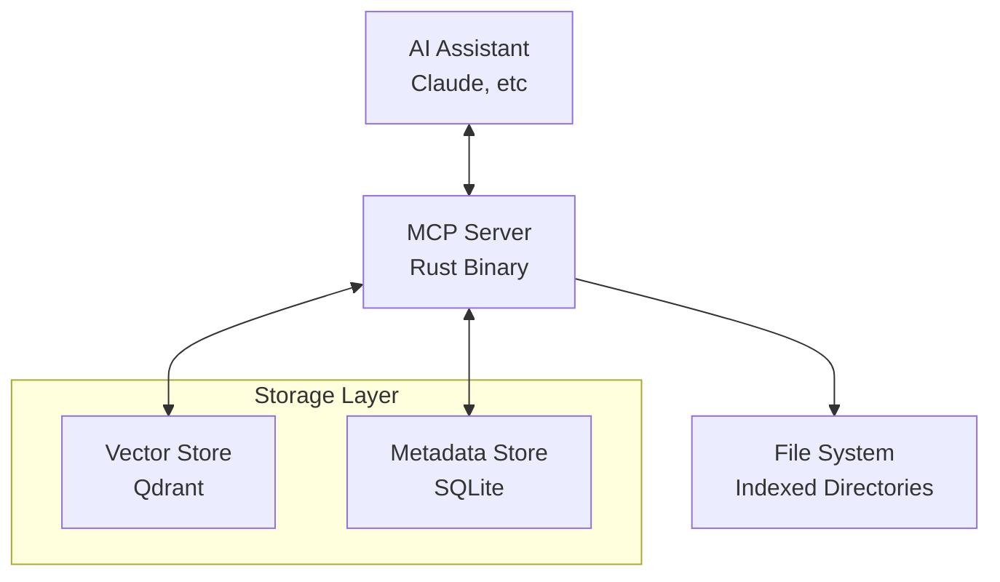
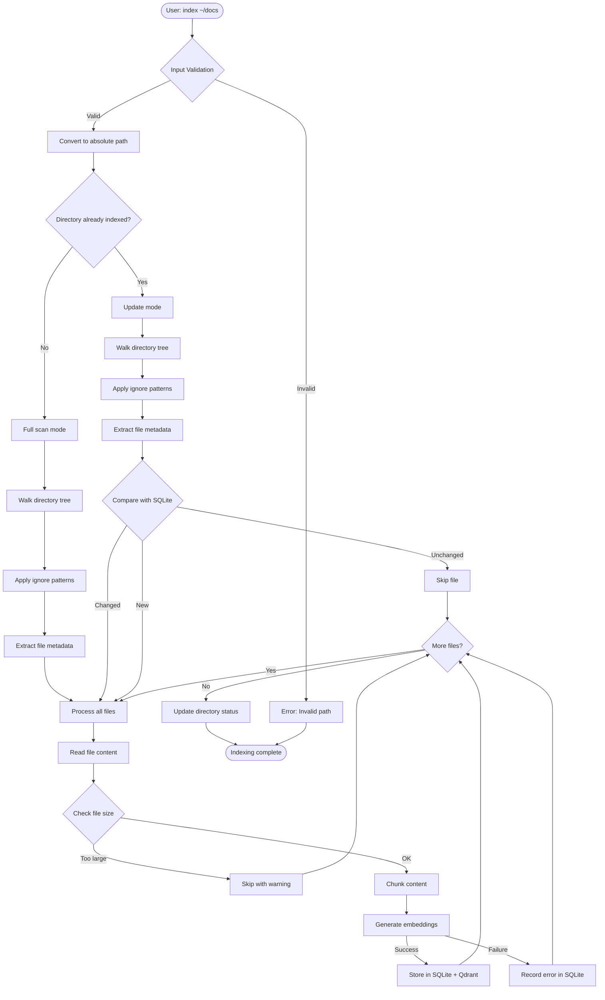
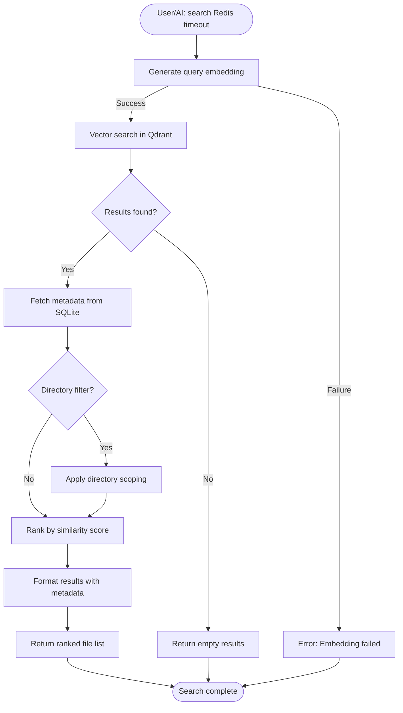
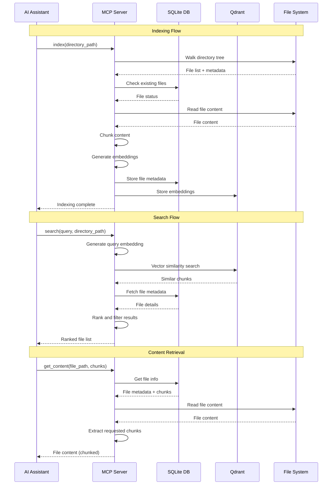

# Directory Indexer Design Document

## Overview

Directory Indexer is a Rust-based MCP server that provides semantic search capabilities over local directories. It creates vector embeddings of files and enables AI assistants to find relevant documents based on meaning and context rather than just filenames.

## Architecture



## Core Components

### 1. CLI Interface
- **Entry Point**: Single Rust binary with mode switching via `--serve` flag
- **Commands**:
  - `index <paths...>` - Index directories and create embeddings
  - `search <query> [path]` - Search indexed content semantically
  - `similar <file> [--limit N]` - Find files similar to given file
  - `get <file> [--chunks N-M]` - Retrieve file content with optional chunk selection
  - `serve` - Start MCP server (persistent mode)
  - `status` - Show indexing status and statistics
- **Path Handling**: Convert relative paths to absolute for internal consistency

### 2. Indexing Engine
- **Directory Processing**: Walk directories recursively, track absolute paths as unique IDs
- **File Processing**: Extract content, create metadata, chunk by token size
- **Update Detection**: Compare file hashes/modified times to detect changes
- **Embedding Generation**: Single embedding provider per configuration

### 3. Storage Layer

#### SQLite Database (Source of Truth)
- **Purpose**: Store file metadata and indexing state
- **Schema**:
  - `directories`: Tracked directory paths, indexing status
  - `files`: File metadata (path, size, modified_time, hash, parent_dirs, chunks_json, errors_json)

#### Qdrant Vector Store
- **Purpose**: Store embeddings and enable vector-based semantic search
- **Data**: Embeddings with minimal metadata (file_path, chunk_id, parent_directories)
- **Collections**: Single collection `directory-indexer` for all indexed directories (enables cross-directory search)

### 4. MCP Server
- **Protocol**: Model Context Protocol implementation
- **Tools**: `index()`, `search()`, `similar_files()`, `get_content()`, `server_info()`
- **Resource Management**: Single persistent process with reused SQLite/Qdrant connections across MCP requests

## Data Flow

### Indexing Process



### Search Process



### MCP Tool Interaction



## Configuration

### Config File Location
- Default: `~/.directory-indexer/config.json`
- Customizable via environment variable or CLI flag

### Config Schema
```json
{
  "storage": {
    "sqlite_path": "~/.directory-indexer/data.db",
    "qdrant": {
      "endpoint": "http://localhost:6333",
      "collection": "directory-indexer"
    }
  },
  "embedding": {
    "provider": "ollama",
    "model": "nomic-embed-text",
    "endpoint": "http://localhost:11434",
    "api_key": null
  },
  "indexing": {
    "chunk_size": 512,
    "overlap": 50,
    "max_file_size": 10485760,
    "ignore_patterns": [".git", "node_modules", "target"],
    "concurrency": 4
  },
  "monitoring": {
    "file_watching": false,
    "batch_size": 100
  }
}
```

## Design Decisions

### Single Embedding Provider
- **Rationale**: Simplifies configuration and prevents embedding space conflicts
- **Trade-off**: Requires full re-indexing when switching providers
- **Implementation**: Store provider info in SQLite to detect changes

### SQLite as Metadata Source of Truth
- **Rationale**: 
  - Single file = single SQLite record (cleaner model)
  - Qdrant chunks would duplicate metadata unnecessarily
  - Enables complex queries on file metadata
- **Metadata in Qdrant**: Only essential search-enhancing data (parent_directories)

### Conditional Resource Dependencies
- **Always Required**: SQLite database, Qdrant server
- **Search & Indexing**: Embedding provider (needed for `index` and `search` operations)
- **Retrieval Only**: `get_content()`, `server_info()`, `status` work without embedding provider
- **Behavior**: Fail immediately if required resources unavailable for the specific operation
- **Rationale**: Allow content retrieval and status operations even when embedding provider is offline

### Simple Update Strategy
- **Approach**: Delete and re-add changed files completely
- **Rationale**: Avoids complex chunk-level change detection
- **Trade-off**: Slightly more work but much simpler code

### No Overlapping Directories
- **Constraint**: Reject indexing requests for overlapping paths
- **Rationale**: Prevents data duplication and simplifies directory tracking
- **Implementation**: Check existing indexed paths before processing

## Error Handling

### Partial Indexing Failures
- **Strategy**: Continue processing successful files
- **Tracking**: Record errors in `errors_json` field of files table
- **Recovery**: Subsequent `index` commands will re-attempt files that failed or changed (no special retry logic needed)

### Resource Unavailability
- **SQLite**: Fail immediately with clear error message
- **Qdrant**: Fail immediately with connection guidance  
- **Embedding Provider**: Fail during indexing and search operations, allow content retrieval and status when offline

### Large Directory Handling
- **Disk Space**: Check available space before indexing
- **Warning Threshold**: Warn if directory size > available space * 0.8
- **User Control**: Allow override with explicit confirmation

## Performance Considerations

### Concurrency
- **File Processing**: Configurable concurrent file processing (default: 4)
- **Embedding Generation**: Respect API rate limits
- **I/O**: Balance file reading with embedding generation

### Memory Management
- **Streaming**: Process files in chunks to control memory usage
- **Batch Processing**: Batch database operations for efficiency
- **Resource Cleanup**: Proper cleanup of file handles and connections

### Scalability
- **SQLite**: Sufficient for expected file counts (< 100K files)
- **Qdrant**: Handles vector operations efficiently
- **Incremental Updates**: Only process changed files

## File Watching (Future Enhancement)

### Optional Feature
- **Default**: Disabled for simplicity
- **Implementation**: Platform-native file watching when enabled
- **Fallback**: Manual refresh via repeated `index` commands

### Design Principles
- **Non-blocking**: File watching shouldn't block main operations
- **Configurable**: Easy to disable if causing issues
- **Resilient**: Graceful handling of watch failures

## Security Considerations

### API Key Handling
- **Storage**: Only in config file, not in database
- **Permissions**: Ensure config file has restrictive permissions (600)
- **Validation**: Validate API keys before long indexing operations

### File Access
- **Sandboxing**: Respect file system permissions
- **Path Validation**: Prevent directory traversal attacks
- **Content Filtering**: Respect ignore patterns and size limits

## Engineering Guidelines

### Code Quality Principles
- **Clarity First**: Always use clear, simple and concise code
- **Self-Explanatory**: Code should be self-explanatory without extensive comments
- **Simplicity**: Prefer simplicity and intuitive patterns over clever solutions
- **Minimal Dependencies**: Avoid pulling in third-party libraries unless essential
- **Robust Design**: Choose patterns that are resilient to edge cases and failures

### Code Organization
- **Single Responsibility**: Each module/function should have one clear purpose
- **Consistent Naming**: Use descriptive names that clearly indicate purpose
- **Error Handling**: Explicit error handling with meaningful error messages
- **Configuration**: Make behavior configurable rather than hardcoded
- **Logging**: Clear, structured logging for debugging and monitoring

### Essential Dependencies Only
- **Core Libraries**: SQLite, Qdrant client, HTTP client for embedding APIs
- **Standard Library**: Prefer Rust standard library and well-established crates
- **Justification**: Any new dependency must solve a significant problem
- **Maintenance**: Avoid dependencies with poor maintenance or unclear licensing

## Testing Strategy

### Unit Tests
- **Storage Layer**: SQLite operations and schema validation
- **Embedding**: Mock embedding provider for consistent tests
- **File Processing**: Chunking and metadata extraction

### Integration Tests
- **Customer-Facing APIs**: Test actual CLI commands and MCP tools that users interact with
- **End-to-End Workflows**: Full indexing and search scenarios using real file systems
- **Non-Fragile Design**: Tests should focus on behavior, not implementation details
- **Error Recovery**: Test graceful handling of common failure scenarios
- **Cross-Platform**: Ensure consistent behavior across operating systems

### Platform Testing
- **Cross-Platform**: Windows, macOS, Linux path handling
- **File Systems**: Different file system behaviors and limits
- **Resource Constraints**: Memory and disk space limitations