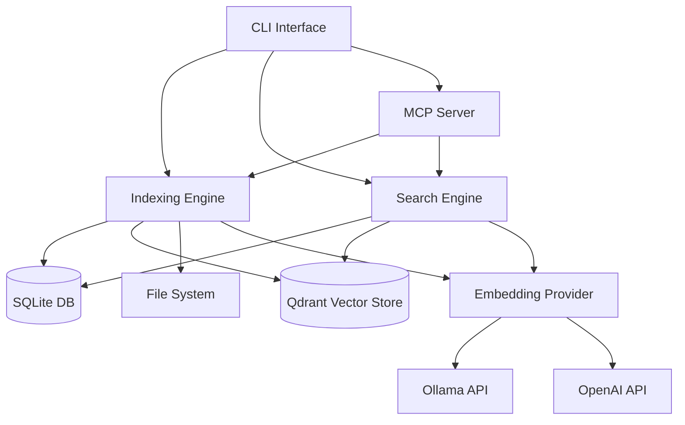
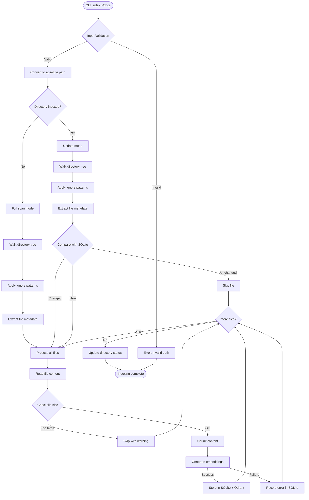
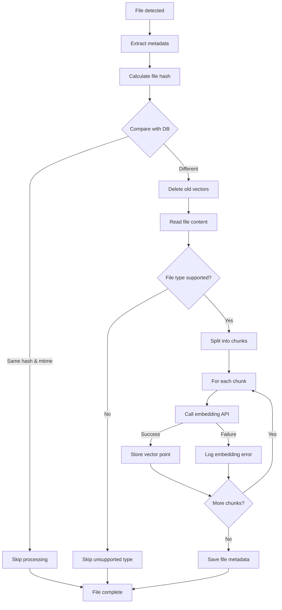
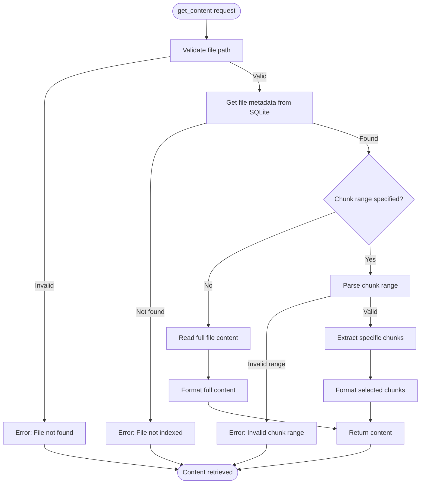
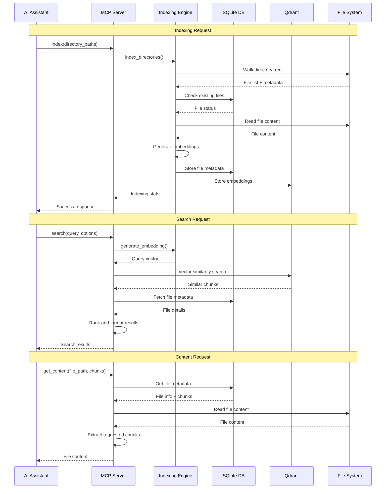
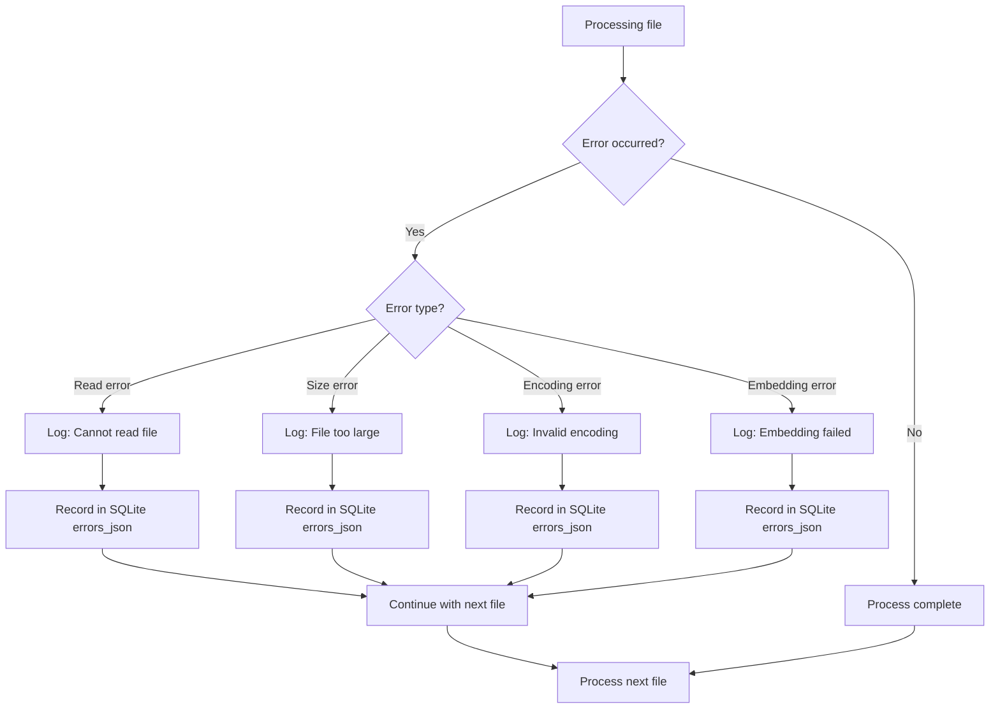
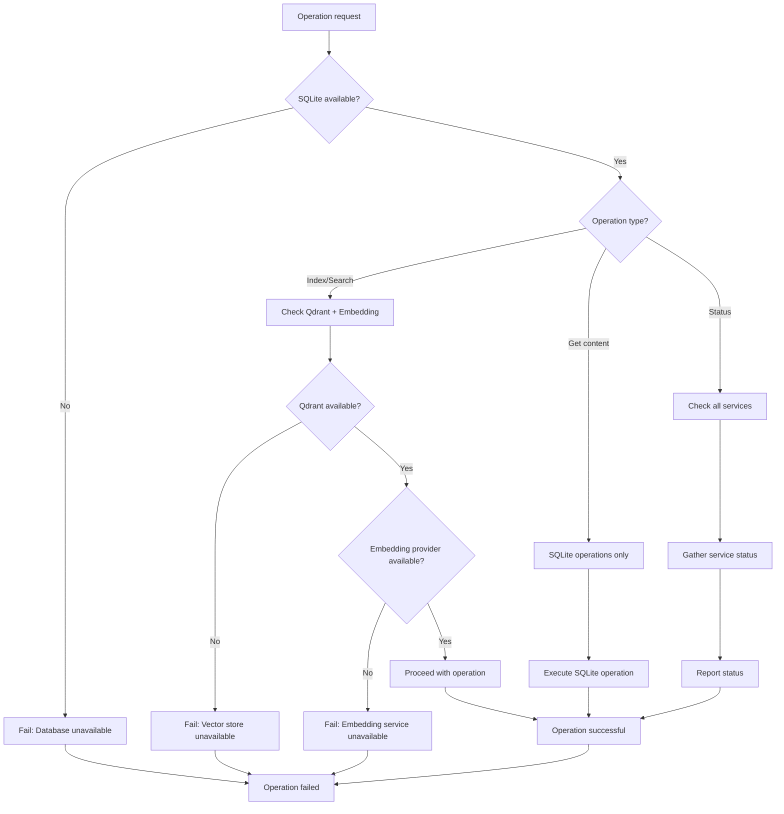

# Directory Indexer Flow Diagrams

This document describes the key operational flows in the directory indexer system.

## System Architecture



## Indexing Flow

### Complete Directory Indexing Process



### File Processing Details



## Search Flow

### Semantic Search Process

```mermaid
flowchart TD
    START([User: search "Redis timeout"]) --> EMBED[Generate query embedding]
    EMBED -->|Success| SEARCH[Vector search in Qdrant]
    EMBED -->|Failure| ERROR[Error: Embedding failed]
    
    SEARCH --> RESULTS{Results found?}
    RESULTS -->|No| EMPTY[Return empty results]
    RESULTS -->|Yes| ENRICH[Fetch metadata from SQLite]
    
    ENRICH --> FILTER{Directory filter?}
    FILTER -->|Yes| SCOPE[Apply directory scoping]
    FILTER -->|No| RANK[Rank by similarity score]
    
    SCOPE --> RANK
    RANK --> PREVIEW[Generate content previews]
    PREVIEW --> FORMAT[Format results with metadata]
    FORMAT --> RETURN[Return ranked file list]
    
    RETURN --> END([Search complete])
    EMPTY --> END
    ERROR --> END
```

### Content Retrieval Flow



## MCP Server Flow

### MCP Tool Interaction



## Error Handling Flows

### File Processing Error Recovery



### Service Connectivity Flow

