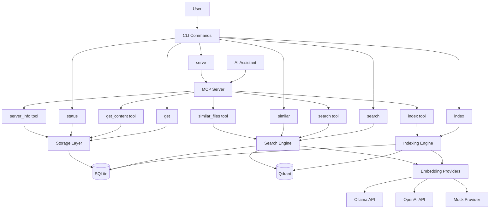
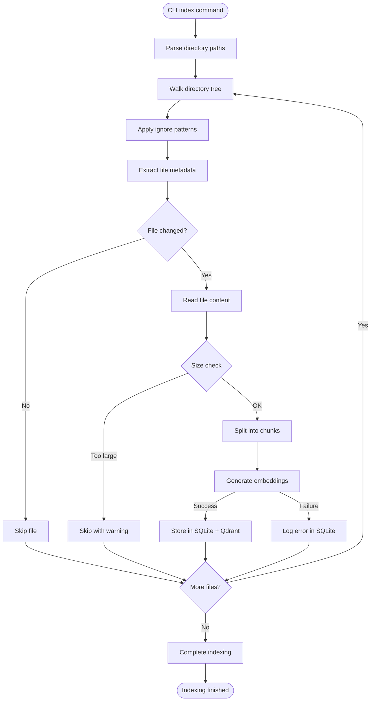
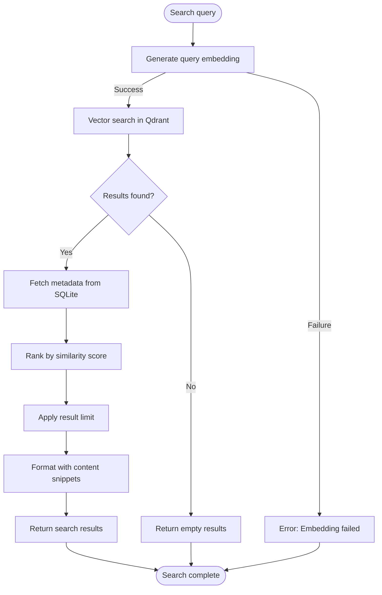
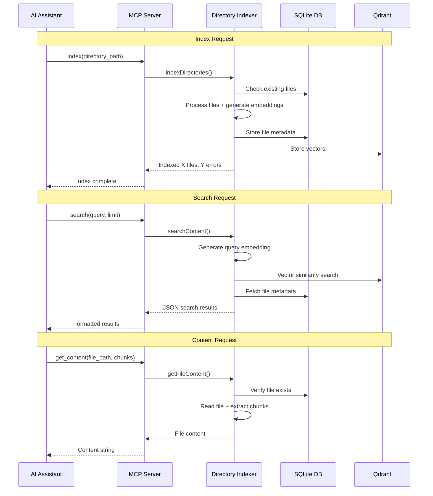
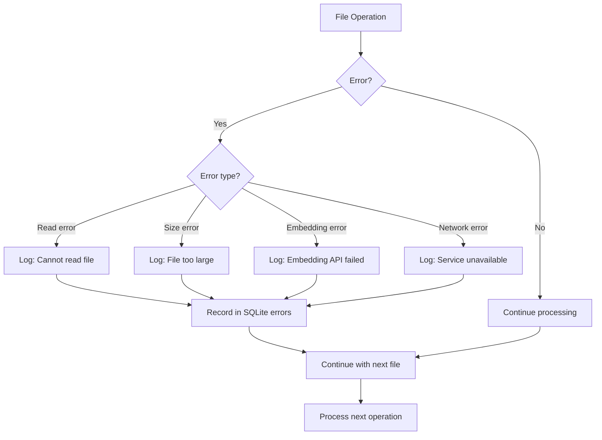
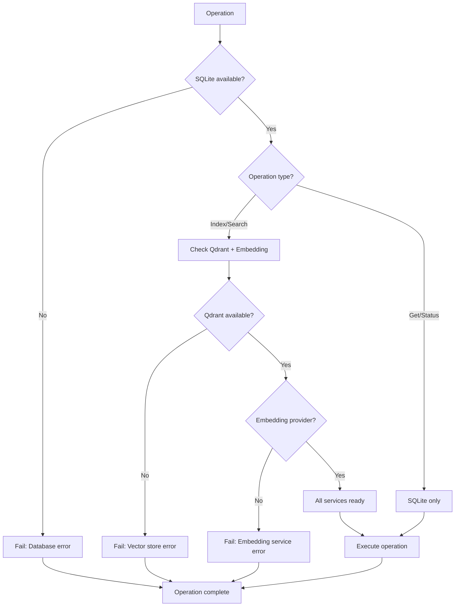
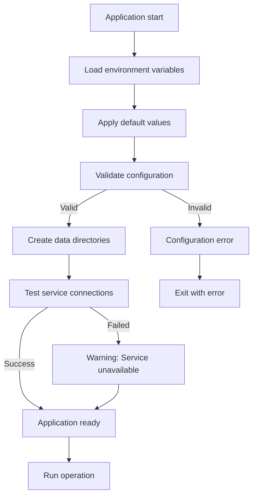

# Directory Indexer Flows

## System Architecture

```mermaid
graph TB
    User[User] --> CLI[CLI Commands]
    AI[AI Assistant] --> MCP[MCP Server]
    
    CLI --> IndexCmd[index]
    CLI --> SearchCmd[search]
    CLI --> SimilarCmd[similar]
    CLI --> GetCmd[get]
    CLI --> StatusCmd[status]
    CLI --> ServeCmd[serve]
    
    MCP --> IndexTool[index tool]
    MCP --> SearchTool[search tool]
    MCP --> SimilarTool[similar_files tool]
    MCP --> GetTool[get_content tool]
    MCP --> InfoTool[server_info tool]
    
    IndexCmd --> Engine[Indexing Engine]
    IndexTool --> Engine
    
    SearchCmd --> Search[Search Engine]
    SearchTool --> Search
    SimilarCmd --> Search
    SimilarTool --> Search
    
    GetCmd --> Storage[Storage Layer]
    GetTool --> Storage
    StatusCmd --> Storage
    InfoTool --> Storage
    
    ServeCmd --> MCP
    
    Engine --> SQLite[(SQLite)]
    Engine --> Qdrant[(Qdrant)]
    Engine --> Providers[Embedding Providers]
    
    Search --> SQLite
    Search --> Qdrant
    Search --> Providers
    
    Storage --> SQLite
    
    Providers --> Ollama[Ollama API]
    Providers --> OpenAI[OpenAI API]
    Providers --> Mock[Mock Provider]
```

## Indexing Flow

```mermaid
flowchart TD
    START([CLI index command]) --> PATHS[Parse directory paths]
    PATHS --> WALK[Walk directory tree]
    WALK --> FILTER[Apply ignore patterns]
    FILTER --> META[Extract file metadata]
    META --> CHECK{File changed?}
    CHECK -->|No| SKIP[Skip file]
    CHECK -->|Yes| READ[Read file content]
    READ --> SIZE{Size check}
    SIZE -->|Too large| SKIP2[Skip with warning]
    SIZE -->|OK| CHUNK[Split into chunks]
    CHUNK --> EMBED[Generate embeddings]
    EMBED -->|Success| STORE[Store in SQLite + Qdrant]
    EMBED -->|Failure| ERROR[Log error in SQLite]
    STORE --> NEXT{More files?}
    SKIP --> NEXT
    SKIP2 --> NEXT
    ERROR --> NEXT
    NEXT -->|Yes| WALK
    NEXT -->|No| COMPLETE[Complete indexing]
    COMPLETE --> END([Indexing finished])
```

## Search Flow

```mermaid
flowchart TD
    START([Search query]) --> EMBED[Generate query embedding]
    EMBED -->|Success| VECTOR[Vector search in Qdrant]
    EMBED -->|Failure| ERROR[Error: Embedding failed]
    VECTOR --> RESULTS{Results found?}
    RESULTS -->|No| EMPTY[Return empty results]
    RESULTS -->|Yes| ENRICH[Fetch metadata from SQLite]
    ENRICH --> RANK[Rank by similarity score]
    RANK --> LIMIT[Apply result limit]
    LIMIT --> FORMAT[Format with content snippets]
    FORMAT --> RETURN[Return search results]
    RETURN --> END([Search complete])
    EMPTY --> END
    ERROR --> END
```

## MCP Integration Flow

```mermaid
sequenceDiagram
    participant AI as AI Assistant
    participant MCP as MCP Server
    participant Engine as Directory Indexer
    participant SQLite as SQLite DB
    participant Qdrant as Qdrant
    
    Note over AI,Qdrant: Index Request
    AI->>MCP: index(directory_path)
    MCP->>Engine: indexDirectories()
    Engine->>SQLite: Check existing files
    Engine->>Engine: Process files + generate embeddings
    Engine->>SQLite: Store file metadata
    Engine->>Qdrant: Store vectors
    Engine-->>MCP: "Indexed X files, Y errors"
    MCP-->>AI: Index complete
    
    Note over AI,Qdrant: Search Request
    AI->>MCP: search(query, limit)
    MCP->>Engine: searchContent()
    Engine->>Engine: Generate query embedding
    Engine->>Qdrant: Vector similarity search
    Engine->>SQLite: Fetch file metadata
    Engine-->>MCP: JSON search results
    MCP-->>AI: Formatted results
    
    Note over AI,Qdrant: Content Request
    AI->>MCP: get_content(file_path, chunks)
    MCP->>Engine: getFileContent()
    Engine->>SQLite: Verify file exists
    Engine->>Engine: Read file + extract chunks
    Engine-->>MCP: File content
    MCP-->>AI: Content string
```

## Error Handling

```mermaid
flowchart TD
    OPERATION[File Operation] --> ERROR{Error?}
    ERROR -->|No| SUCCESS[Continue processing]
    ERROR -->|Yes| TYPE{Error type?}
    
    TYPE -->|Read error| LOG1[Log: Cannot read file]
    TYPE -->|Size error| LOG2[Log: File too large]
    TYPE -->|Embedding error| LOG3[Log: Embedding API failed]
    TYPE -->|Network error| LOG4[Log: Service unavailable]
    
    LOG1 --> RECORD[Record in SQLite errors]
    LOG2 --> RECORD
    LOG3 --> RECORD
    LOG4 --> RECORD
    
    RECORD --> CONTINUE[Continue with next file]
    SUCCESS --> CONTINUE
    CONTINUE --> NEXT[Process next operation]
```

## Service Dependencies

```mermaid
flowchart TD
    START[Operation] --> SQLITE{SQLite available?}
    SQLITE -->|No| FAIL1[Fail: Database error]
    SQLITE -->|Yes| TYPE{Operation type?}
    
    TYPE -->|Index/Search| SERVICES[Check Qdrant + Embedding]
    TYPE -->|Get/Status| PROCEED1[SQLite only]
    
    SERVICES --> QDRANT{Qdrant available?}
    QDRANT -->|No| FAIL2[Fail: Vector store error]
    QDRANT -->|Yes| EMBEDDING{Embedding provider?}
    
    EMBEDDING -->|No| FAIL3[Fail: Embedding service error]
    EMBEDDING -->|Yes| PROCEED2[All services ready]
    
    PROCEED1 --> SUCCESS[Execute operation]
    PROCEED2 --> SUCCESS
    SUCCESS --> END[Operation complete]
    
    FAIL1 --> END
    FAIL2 --> END
    FAIL3 --> END
```

## Configuration Flow

```mermaid
flowchart TD
    START[Application start] --> ENV[Load environment variables]
    ENV --> DEFAULTS[Apply default values]
    DEFAULTS --> VALIDATE[Validate configuration]
    VALIDATE -->|Invalid| ERROR[Configuration error]
    VALIDATE -->|Valid| DIRS[Create data directories]
    DIRS --> CONNECT[Test service connections]
    CONNECT -->|Failed| WARN[Warning: Service unavailable]
    CONNECT -->|Success| READY[Application ready]
    WARN --> READY
    READY --> RUN[Run operation]
    ERROR --> EXIT[Exit with error]
```